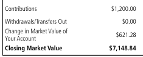
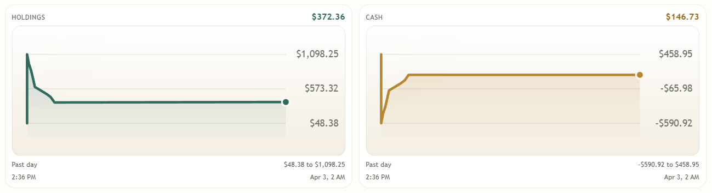

# moomoo AI Agent Arena

Local-only AI agent trading arena and execution service for a small US equities competition using moomoo OpenAPI.

## Current scope
- FastAPI backend with SQLite persistence
- Embedded backend-served agent arena at `/` so the runtime can start without Node
- Broker abstraction with `mock` and `moomoo` backends
- Broker health, account discovery, external quotes, positions, orders, and paper order endpoint
- Two competing US-stocks-only AI agents: `Pick-and-Shovel Growth Agent` and `Liberated US Stocks Agent`
- Competition allocator: the better-performing surviving agent gets more capital
- Elimination rule: after the first `90 days`, an agent loses if its total return trails the S&P 500 proxy `US.SPY`
- Local agent ledger with agent-tagged trade events and virtual agent holdings
- Live research notes plus generated agent ideas sourced from filings, headlines, and current quote context
- React/Vite frontend source is still present for future work, but it is no longer required to start the local runtime
- Default risk profile tuned for a bankroll around `$1,000`

## Stack
- Backend: Python, FastAPI, SQLAlchemy, SQLite
- Frontend: React, TypeScript, Vite
- Broker: moomoo OpenAPI via local `OpenD`

## Quick start

### Backend setup
```powershell
.\scripts\setup-backend.ps1
.\scripts\run-backend.ps1
```

To start the arena from a clean local state, remove the local ledger first:
```powershell
.\scripts\reset-db.ps1
```

For a real moomoo connection instead of the mock adapter, first make sure `moomoo` is already installed in the embedded Python, or provide a local package path:

```powershell
.\scripts\setup-backend.ps1 -IncludeMoomoo
```

```powershell
.\scripts\setup-backend.ps1 -IncludeMoomoo -MoomooPackagePath 'C:\path\to\MMAPI4Python_10.1.6108'
```

If you prefer your own virtual environment:
```powershell
python -m pip install -r requirements.txt
cd backend
python -m uvicorn app.main:app --host 127.0.0.1 --port 8000
```

If you already started an older version of this scaffold, the runtime will rename old `sleeve_*` SQLite tables to `agent_*` on startup.

### Open the arena
- Embedded agent arena: `http://localhost:8000`
- Backend docs: `http://localhost:8000/docs`

## Recent paper-trading results
The screenshot below shows a recent paper-trading snapshot from the local agent arena.



The arena can also push agents into aggressive catch-up behavior when one starts trailing. The screenshot below shows that competitive pressure more clearly: agents can rotate hard, stretch cash, and chase performance just to close the gap with the other side.



## moomoo setup
1. Install and run `OpenD`.
2. Log in with the same moomoo account you use for paper trading.
3. Confirm your paper account is visible in OpenAPI.
4. Set these values in `backend/.env`:
   - `BROKER_BACKEND=moomoo`
   - `MOOMOO_HOST=127.0.0.1`
   - `MOOMOO_PORT=11111`
   - `MOOMOO_TRD_ENV=SIMULATE`
   - `MOOMOO_ACC_ID=<your paper acc_id>` (recommended, but blank now falls back to the first matching SIMULATE account)
5. Start the backend and verify `/broker/health` and `/broker/accounts`.
6. For quotes, either keep `QUOTE_PROVIDER=broker` if your moomoo account has quote rights, or switch to Alpaca below.

## External quotes without moomoo rights
Use this if moomoo paper trading works but moomoo OpenAPI quote rights cost money.

### Twelve Data
1. Create a Twelve Data account and get an API key.
2. Set these values in `backend/.env`:
   - `QUOTE_PROVIDER=twelvedata`
   - `TWELVEDATA_API_KEY=<your key>`
3. Restart the backend.
4. Verify `/quotes/US.NVDA`.

Notes:
- Twelve Data's docs expose a `/quote` endpoint and their pricing page currently lists a free Basic plan with real-time US stocks and ETFs.
- I did not find a US-residency requirement in Twelve Data's official docs; that is an inference from the absence of such a restriction.
- Twelve Data returns last/previous-close style quote data, not broker-native bid/ask depth.

### Alpaca
1. Create an Alpaca account and generate market-data API credentials.
2. Set these values in `backend/.env`:
   - `QUOTE_PROVIDER=alpaca`
   - `ALPACA_DATA_API_KEY=<your key>`
   - `ALPACA_DATA_SECRET=<your secret>`
   - `ALPACA_DATA_FEED=iex`
3. Restart the backend.
4. Verify `/quotes/US.NVDA`.

Notes:
- `iex` is Alpaca's free data feed, but it is only a subset of the full US market and is better for testing than live execution decisions.
- moomoo stays the broker for orders and account state; only quotes move to the external provider.

## Important notes
- `live_capped` is now wired for broker execution, but it only permits the `Pick-and-Shovel Growth` agent and uses the configured live capped order-size limit.
- Both agents are limited to `US-listed stocks` only.
- For US paper trading, the backend keeps `regular-hours only` and `limit orders only`.
- moomoo symbols should be entered in API format such as `US.NVDA`.
- Agent competition is tracked in a local agent ledger using current mark-to-market plus a cached `US.SPY` benchmark race. After the warm-up window, trailing the benchmark is losing the game. Broker custody and broker positions are still commingled in one moomoo account.
- In `mock` mode, paper orders are filled immediately so the agent game updates end to end.
- In `moomoo` mode, the runtime syncs recent order history so filled paper orders can be reflected in the agent ledger even when they are no longer open orders.


## Agent autopilot
- The backend now supports autopilot in `paper` and `live_capped` modes.
- Use `POST /agents/cycle` to run one decision cycle manually.
- Use `GET /agents/autopilot` and `POST /agents/autopilot` to inspect or toggle the background loop.
- Use `POST /research/run` and `GET /research/notes` to refresh and inspect the live research evidence layer.
- The liberated agent now refreshes its own research queue from live sources and exits when a held name falls out of the current thesis set.
- The pick-and-shovel agent stays constrained to bottleneck names, while the liberated agent can generate fresh US-stock ideas from the live research pipeline.
- In `live_capped`, autopilot only trades the `Pick-and-Shovel Growth` agent and uses the live broker environment/account configuration.

